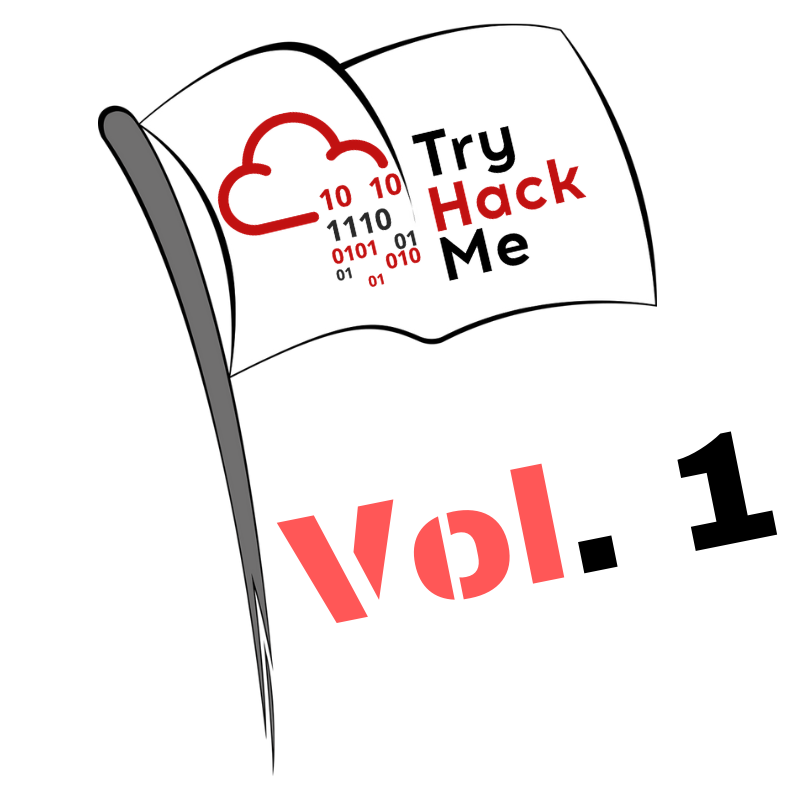

# CTF Collection Volume 1 – Write-up

The CTF Collection Volume 1 room is a beginner-friendly set of challenges designed to introduce a variety of fundamental techniques used in Capture The Flag competitions. Instead of focusing on a single topic, this room explores multiple areas such as steganography, cryptography, metadata analysis, and basic web exploitation.

While the tasks are relatively simple, they provide a solid foundation for understanding how to approach different types of challenges and, more importantly, how to think when solving them.

In this write-up, I will walk through my thought process for all the 20 tasks, focusing not only on the tools used but also on why each step was taken.

## Task 1 – Base64 Decoding

The first task presented an encoded string. Based on its format (ending with `=` and readable character set), it strongly resembled Base64 encoding.

To confirm this, I used:

```echo "encoded_string" | base64 -d```

This successfully revealed the flag.

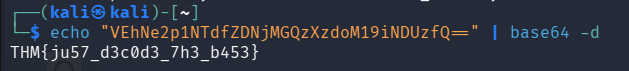

## Task 2 – Metadata Analysis

The second task involved an image file. Instead of looking at the image visually, I checked for hidden information inside its metadata.

Using:

```exiftool image.jpg```

I was able to extract metadata fields, where the flag was embedded.

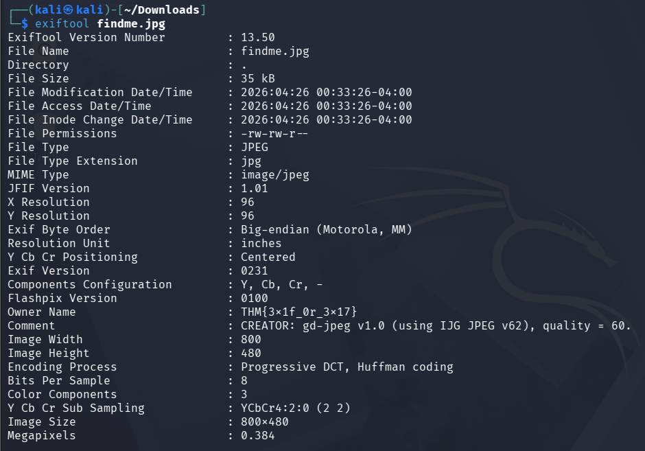

## Task 3 – Steganography

This task suggested hidden data inside an image, likely using steganography.

I used:

```steghide extract -sf image.jpg```

In this case, no passphrase was required (simply pressing Enter). In harder challenges, the passphrase would need to be identified through further enumeration or analysis.

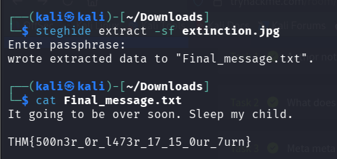

## Task 4 – Hidden Text in Web Page

At first glance, the page appeared empty or contained only black text. However, this is often a trick.

By either:

+ Highlighting the page with the mouse, or
+ Inspecting the HTML source

I discovered hidden text containing the flag.

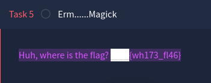

## Task 5 – QR Code Decoding

This task involved a QR code. There are multiple ways to approach this:

+ Using a phone camera
+ Using tools like `zbarimg` on Kali
+ Online decoders

For this task, I decided to use:

```zbarimg qrcode.png```

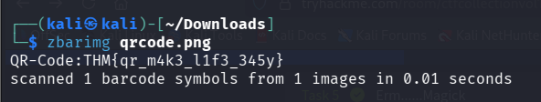

Which directly returned the decoded content containing the flag.

## Task 6 – Inspecting an ELF Binary

The challenge provided a 64-bit ELF binary. Instead of executing it immediately, I chose to inspect its contents.

Since TryHackMe flags typically start with “THM”, I filtered the output accordingly:

```strings hello.hello | grep THM```

This extracts readable strings and narrows the results to likely flag candidates.

The flag appeared directly in the output.

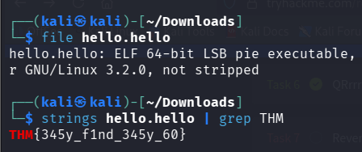

## Task 7 – Base58 / Encoded String

This task involved an encoded string that didn’t match common formats like Base64.

After identifying the encoding as Base58, I decoded it with:

```echo "encoded_string" | base58 -d```

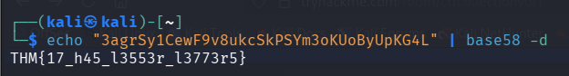

## Task 8 – Caesar Cipher (ROT Cipher)

The text appeared readable but didn’t make sense, suggesting a substitution cipher.

The hint indicated that it was a Caesar cipher, so I used [dCode](https://www.dcode.fr/en) to test multiple shifts at once.

One of the outputs (ROT7) revealed the flag.

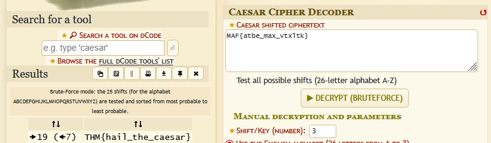

## Task 9 – Inspecting Page Source

This task required inspecting the HTML source of the TryHackMe page itself.

By right-clicking → Inspect i found the flag hidden in the HTML.

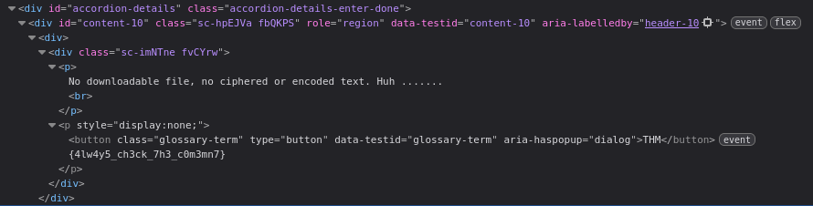

## Task 10 – Corrupted PNG File

The file appeared to be a PNG, but running:

```file spoil.png```

showed it as generic “data”, indicating that the header was likely corrupted.

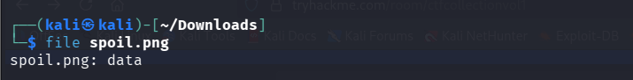

Since PNG files have a well-known magic number, I opened the file in a hex editor and corrected the header to the proper signature.

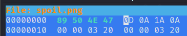

After fixing the header, the file was properly recognized and could be opened normally.

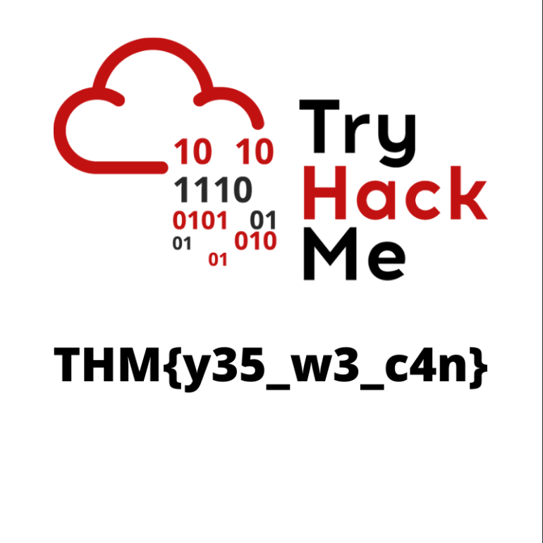

## Task 11 – Google Dorking

This task involved using a Google dork. Based on the hint, the search was specifically focused on Reddit:

```site:reddit.com intext:"THM"```

The goal was to find indexed Reddit posts containing the flag.

However, in this case, the original post had been deleted, meaning the flag was no longer directly accessible.

Instead of stopping there, a better approach would be:

+ Try using the [Wayback Machine](https://web.archive.org/) to check archived versions of the page
+ Look for cached results in Google
+ Search for alternative write-ups to confirm the expected solution

In this case, I used the Wayback Machine to access an archived version of the post, where the flag was still available.

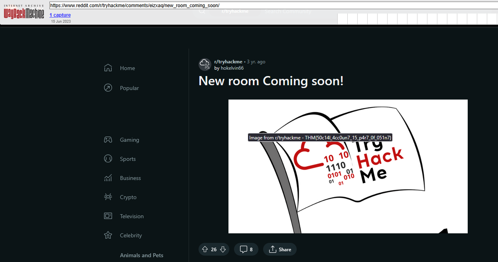

## Task 12 – Brainfuck Decoding

The hint explicitly mentioned Brainfuck, which is an esoteric programming language.

The provided code can be decoded using tools like:

+ Online decoders (e.g., dcode)
+ Scripts or interpreters

After decoding, the output revealed the flag.

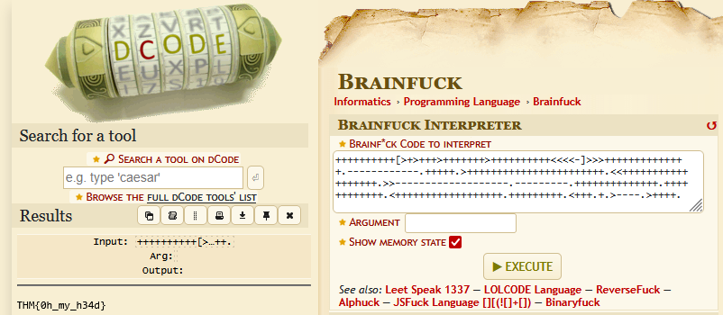

## Task 13 – XOR Decoding

This task involved two encoded strings that needed to be XORed together.

At first glance, the second value looked like binary due to its pattern (1010...). 

However, it was actually intended to be interpreted as hexadecimal, which is why treating both inputs as hex produced the correct result.

To solve this, I XORed the two values.

One way to do this was using Python:

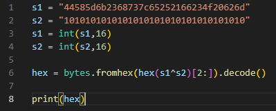

Alternatively, I used an online XOR calculator by setting both inputs to hexadecimal, which directly revealed the flag.

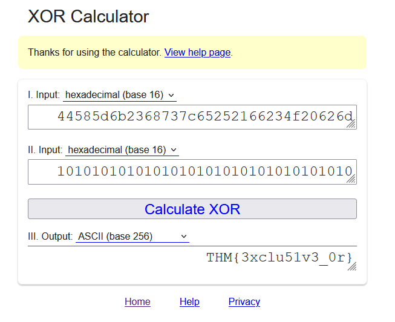

## Task 14 – Extracting Hidden Files with Binwalk

The challenge provided an image file, but it contained embedded data.

Using:

``binwalk -e hell.jpg``

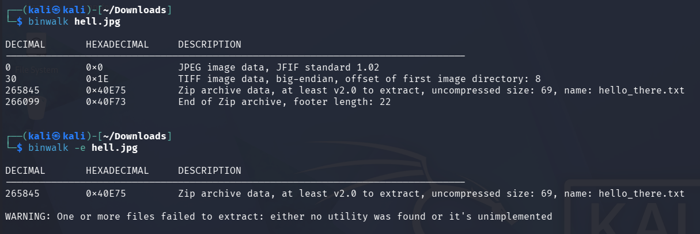

This extracted hidden files inside the image.

Inside the extracted directory, there was a file called:

```hello_there.txt```

Reading it revealed the flag.

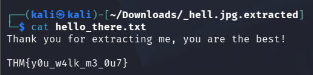

## Task 15 – Hidden Data in Image

The image appeared completely black, which is suspicious and often indicates hidden content.

Instead of using specialized tools, I opened the image in a basic editor (MS Paint) and changed the background color using the fill tool. This revealed the hidden content and the flag.

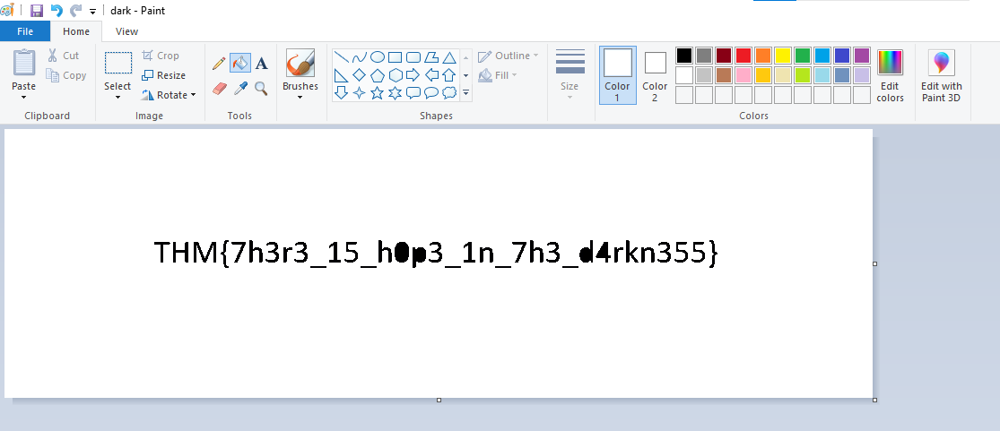

Alternatively, tools like `Stegsolve` could be used for deeper analysis.

## Task 16 – QR Code to Audio

This task also involved a QR code.

Using `zbarimg` again, I decoded the QR code and obtained a link to an audio file hosted on SoundCloud.

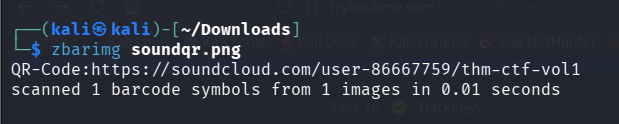

After accessing the link, the audio contained a voice clearly stating the flag.

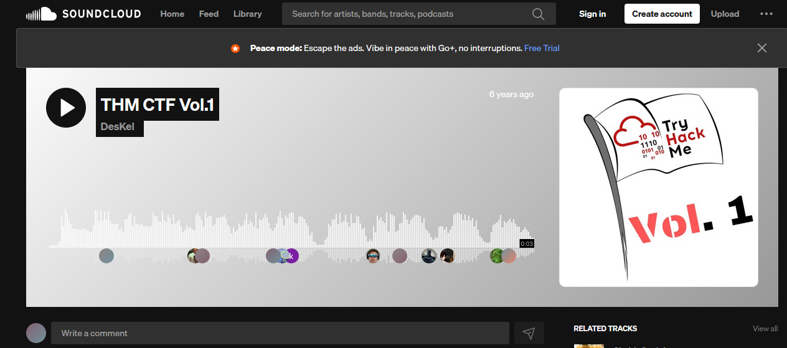

## Task 17 – Wayback Machine

The hint:

“*Sometimes we need a ‘machine’ to dig the past*”

This clearly refers to the Wayback Machine, which was also used in a previous task.

The challenge provided two key pieces of information:

+ Target website: https://www.embeddedhacker.com/
+ Target time: *2 January 2020*

Using this, I navigated to the specified website on the Wayback Machine and selected the corresponding snapshot.

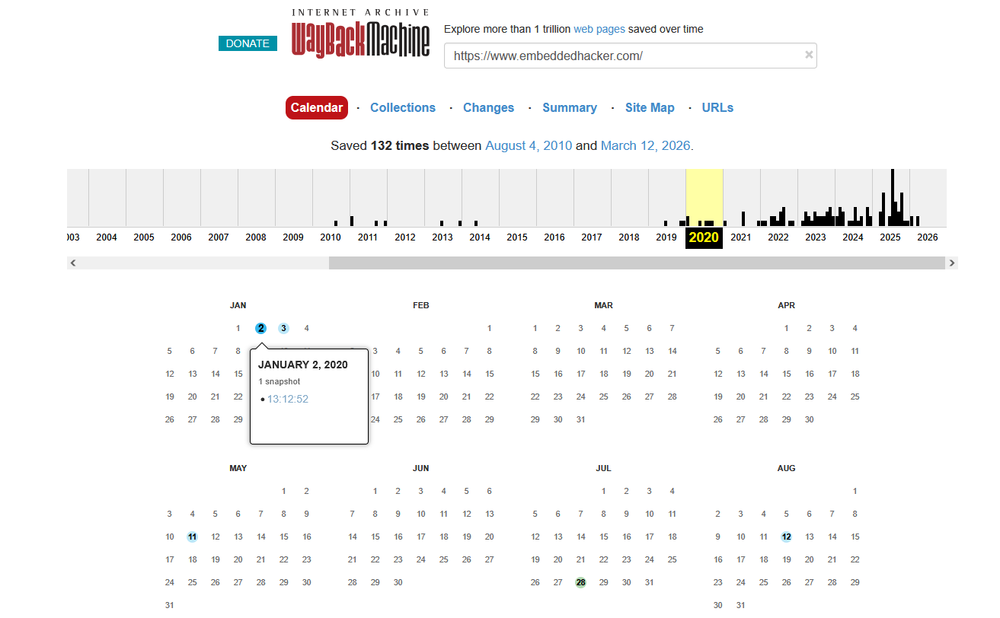

After opening the archived page from that date, the flag was visible.

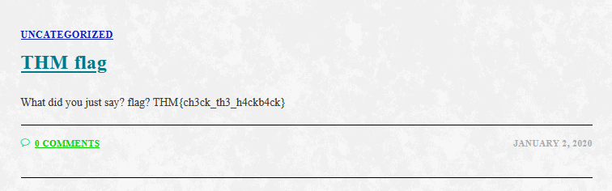

## Task 18 – Vigenère Cipher

The task involved a Vigenère cipher, as indicated by the hint.

Since no key was provided, and considering this is a beginner-level CTF, I tried a common key such as “*THM*”.

Using dCode, I decoded the ciphertext with this key, which successfully revealed the flag.

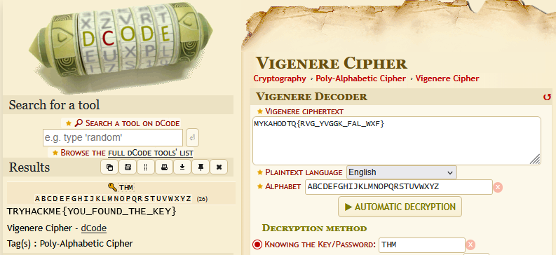

### How this works (important)

The Vigenère cipher is essentially a series of Caesar shifts controlled by a repeating key.

In more advanced CTFs, the key would not be this straightforward. Instead, you might need to:

+ Look for hints or patterns in the challenge
+ Perform frequency analysis
+ Apply techniques such as Kasiski examination
+ Attempt brute force with scripts

## Task 19 – Encoding Chain

The hint explicitly indicated the required steps:

*dec → hex → ascii*

Following this sequence, the solution involved converting the values step by step.

First, I converted the decimal values into hexadecimal, and then converted the hexadecimal into ASCII, which revealed the flag.

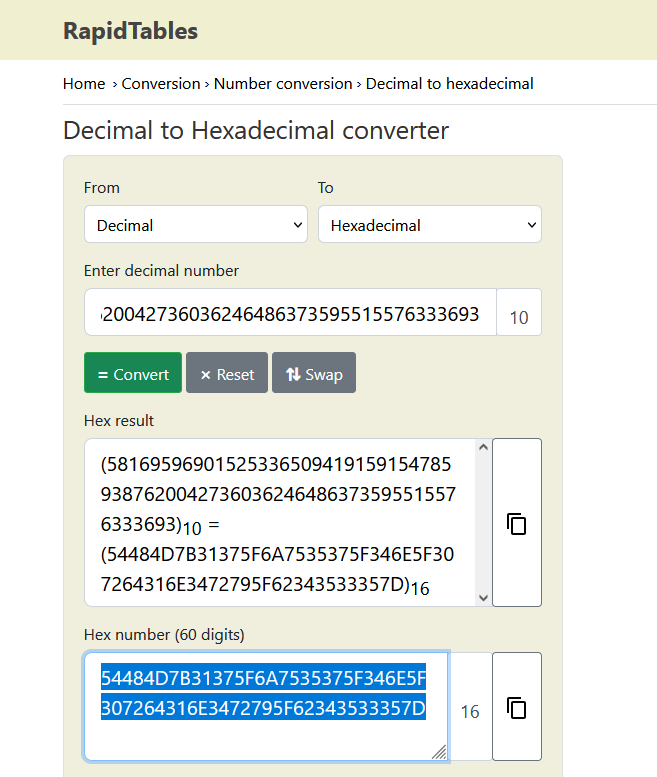

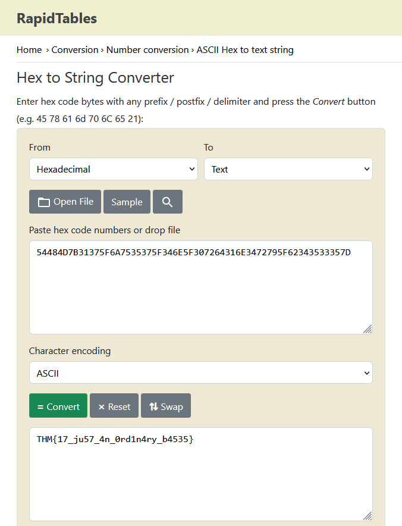

Alternatively, this process can be automated using Python:

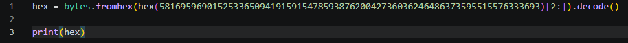

## Task 20 – PCAP Analysis

The final task provided a .pcap file for analysis.

Based on the hint to check the streams, i opened the capture in Wireshark and began inspecting the traffic.

To narrow down the results, I applied the following filter:

`http`

This made it easier to focus on HTTP traffic, where useful data is often transmitted in plain text.

While reviewing the requests, I found a HTTP GET request containing the flag.

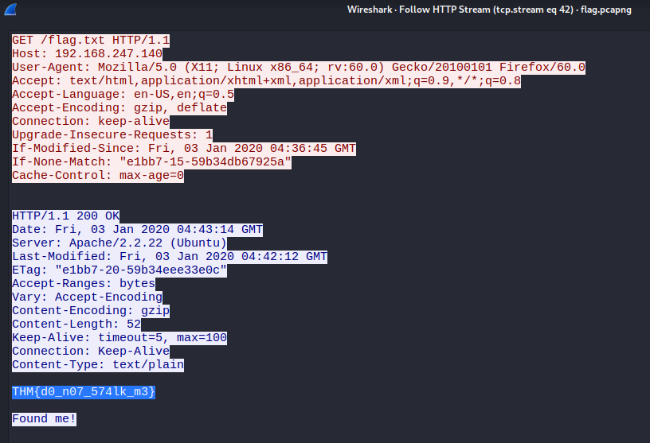

## Conclusion

This room was a really solid mix of beginner-friendly CTF techniques, covering everything from encoding and steganography to file analysis and basic network inspection. More than just using tools, it showed how important it is to combine them with online resources, research, and a bit of curiosity.

One thing that stood out is that most challenges didn’t require anything crazy, it was more about recognizing patterns, following hints, and knowing where to look. Whether it was decoding data, fixing corrupted files, or digging through archived pages, the focus was always on thinking things through rather than overcomplicating.

Another big takeaway is efficiency. Sometimes the simplest approach (like using MS Paint or an online decoder) works just as well as more advanced tools. Having multiple ways to solve the same problem — manual, scripted, or web-based makes a huge difference.
