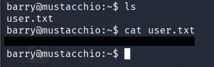
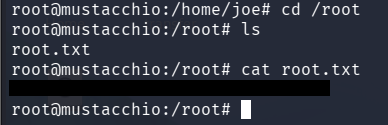

# Mustacchio - Write-up

In this room, the goal was to enumerate the target machine, identify hidden services and vulnerable functionality, exploit an XXE vulnerability to gain SSH access, and finally escalate privileges through a PATH Hijacking vulnerability in a SUID binary.

## Initial Recon

The first step was performing a basic Nmap scan to identify open ports and running services.


The scan revealed:

+ SSH running on port 22
+ HTTP service running on port 80

After discovering the web server, directory enumeration was performed using Gobuster.


During the scan, an interesting directory was discovered:

```/custom/js```

## Database Discovery

Inside the `/custom/js` directory, a file named `users.bak` was found.


To identify the file type, the `file` command was used and the output showed that the file was an SQLite database.

## Extracting Credentials from SQLite

The database was opened with SQLite3:

```sqlite3 users.bak```

First, the available tables were listed:

`.tables`

A `users` table was found.

The contents were dumped with:

```.dump users```

This revealed a username and password hash:


## Hash Cracking

To identify the hash type, `hash-identifier` was used.

The hash was identified as SHA-1.


Using an online SHA-1 decoder, the password was cracked:


## Additional Enumeration

The discovered credentials did not work for SSH access, so more enumeration was required.

A full TCP port scan was performed:

```nmap -p- TARGET-IP``` 


This revealed another service running on a high port : `8765`

Opening the service in the browser revealed a login panel.

## XXE Vulnerability

After logging into the panel using the discovered credentials, the application requested XML input.


This strongly suggested the possibility of an XXE (XML External Entity) vulnerability.

## Testing XXE

To confirm the vulnerability, an attempt was made to read `/etc/passwd`.

The following payload was used:

```
<!DOCTYPE foo [
 <!ENTITY test SYSTEM "file:///etc/passwd">
]>
<preview>
<name>&test;</name>
<author>a</author>
<comment>b</comment>
</preview>
```

The server returned the contents of `/etc/passwd`, confirming that XXE injection was possible at the name or/and author tags.


## Obtaining the SSH Key

The page source mentioned that Barry could log in through SSH using his key.


Using the XXE vulnerability, Barry's private SSH key was requested:

```file:///home/barry/.ssh/id_rsa```


The server returned the private RSA key.

## Cracking the Private Key Passphrase

The retrieved key was protected with a passphrase.

The key formatting had to be fixed first so that it matched the correct RSA structure.

After saving the key as `id_rsa`, it was converted into a crackable hash using `ssh2john`:

```ssh2john id_rsa > hash.txt```

Then John the Ripper was used with the RockYou wordlist:

```john hash.txt --wordlist=/usr/share/wordlists/rockyou.txt```

The discovered passphrase was:

`urieljames`


## SSH Access and User Flag

Using the private key and passphrase, SSH access was obtained as Barry.

Once connected, the user flag was collected.



## Privilege Escalation

Since `sudo -l` did not provide anything useful, SUID files were searched manually:

```find / -user root -perm -u=s 2>/dev/null```

An unusual binary was found:

```/home/joe/live_log```


Running `strings` on the binary revealed that it executed the `tail` command without using its absolute path.


This indicated a possible PATH Hijacking vulnerability.

## PATH Hijacking Exploitation

Since the binary executed `tail` without specifying `/usr/bin/tail`, it was possible to create a fake `tail` executable and force the system to execute it first.


The PATH variable was modified so /tmp would be searched before system directories:

```export PATH=/tmp:$PATH```

Then a malicious fake `tail` file was created inside `/tmp`:

```
echo '/bin/bash' > /tmp/tail
chmod +x /tmp/tail
```

To confirm the modification:

```echo $PATH```

Finally, the vulnerable binary was executed:

```./live_log```


Because the program was running as root and called `tail` without an absolute path, it executed the malicious `/tmp/tail` file instead, spawning a root shell.

## Root Flag

With root access obtained, the final flag was collected.



## Conclusion

This room was a great introduction to several important concepts used in penetration testing and CTF challenges:

+ Service enumeration with Nmap
+ Web directory brute forcing
+ SQLite database analysis
+ Password hash cracking
+ XXE exploitation
+ SSH key attacks
+ SUID privilege escalation
+ PATH Hijacking

The privilege escalation step was especially interesting because it demonstrated how dangerous it can be for privileged binaries to execute commands without absolute paths.
