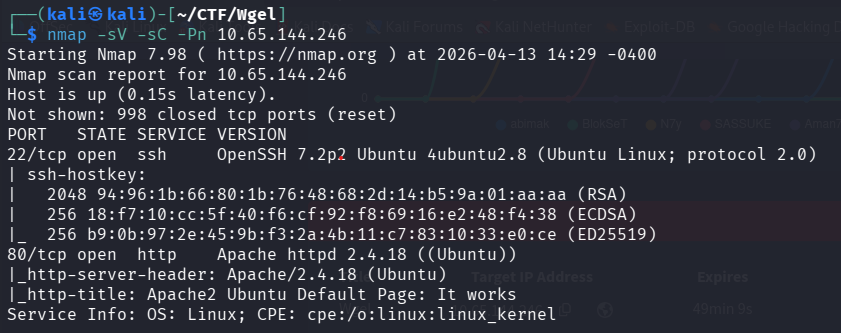
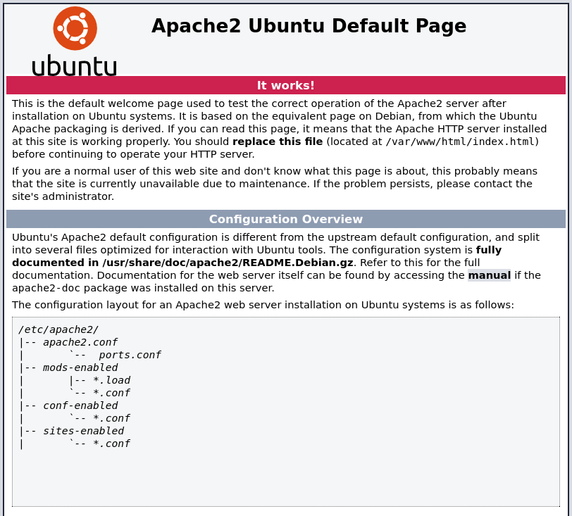
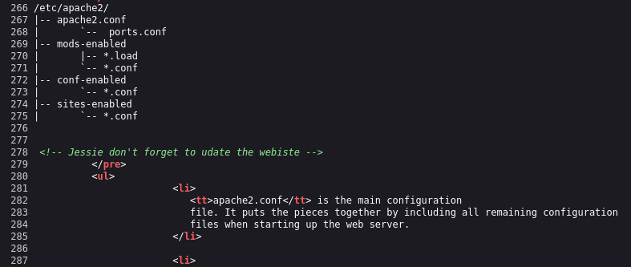

# Wgel CTF - Write-up

This is an easy Linux machine. The goal is to obtain both the user and root flags.

# Initial Recon

After starting the machine and obtaining its IP address, the first step was to perform a port scan using Nmap:



The scan revealed that an HTTP service was running, so the next step was to enumerate the web server.

# Web Enumeration

Accessing the IP in the browser showed the default Apache2 Ubuntu page:



Although nothing useful appeared at first glance, checking the page source revealed a potential username:

```Jessie```


